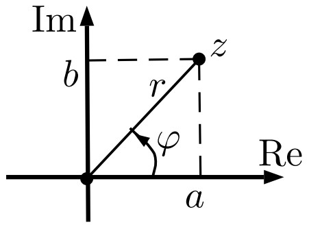

# Тригонометрическая форма записи комплексного числа. Изменение модуля и аргумента при перемножении комплексных чисел. Формула Муавра.

### **Определение**

+ Рассмотрим декартову систему координат в $\mathbb{R}^2$, по оси абсцисс будем откладывать вещественную часть, а по оси ординат — мнимую. Тогда комплексное сопряжение — симметрия относительно оси абсцисс.
+ Для числа $z = (a, b) \in \mathbb{C}$ тогда $r = |z| = \sqrt{a^2 + b^2}$ — расстояние от начала координат до $z$.
+ **Аргумент** $z$ — это направленный угол $\mathrm{arg}(z) = \varphi$ от оси абсцисс до луча $Oz$ против часовой стрелки. Вычисляется с точностью до прибавления $2\pi k$, где $k \in \mathbb{Z}$.
+ Пара $(r, \varphi)$ однозначно задает точку $z$.
+ $a = r \cos(\varphi)$, $b = r \sin(\varphi)$.
+ **Тригонометрическая форма записи комплексного числа:**
  $z = (r \cos(\varphi), r \sin(\varphi))$
+ Если $z = (r \cos(\varphi), r \sin(\varphi))$, то $|z| = r$, $\mathrm{arg}(z) = \varphi$.

### **Теорема 2**

Пусть $x, y \in \mathbb{C}$. Тогда $|xy| = |x||y|$ и $\mathrm{arg}(xy) = \mathrm{arg}(x) + \mathrm{arg}(y)$.

#### **Доказательство**

> + Пусть $x = (r \cos(\varphi), r \sin(\varphi))$, а $y = (p \cos(\psi), p \sin(\psi))$. Тогда
>   $xy = \big(rp(\cos(\varphi) \cos(\psi) - \sin(\varphi) \sin(\psi)), rp(\cos(\varphi) \sin(\psi) + \sin(\varphi) \cos(\psi))\big) = \big(rp \cos(\varphi + \psi), rp \sin(\varphi + \psi)\big)$
> + Следовательно, $|xy| = rp$ и $\mathrm{arg}(xy) = \varphi + \psi$.

### **Теорема 3**

**Формула Муавра**. Пусть $z \in \mathbb{C}$, $n \in \mathbb{N}$. Тогда $|z^n| = |z|^n$ и $\mathrm{arg}(z^n) = n \cdot \mathrm{arg}(z)$.

#### **Доказательство**

> **Индукция по $n$.** База $n = 1$ очевидна.
> Переход $n \to n + 1$.
>
> + Пусть $|z| = r$, $\mathrm{arg}(z) = \varphi$ и утверждение доказано для $n$, то есть, $|z^n| = r^n$ и $\mathrm{arg}(z^n) = n\varphi$.
> + По [Теореме 2](2.md#Теорема-2) $|z^{n+1}| = |z||z^n| = r \cdot r^n = r^{n+1}$ и $\mathrm{arg}(z^{n+1}) = \mathrm{arg}(z) + \mathrm{arg}(z^n) = \varphi + n\varphi = (n + 1)\varphi$.
>   
