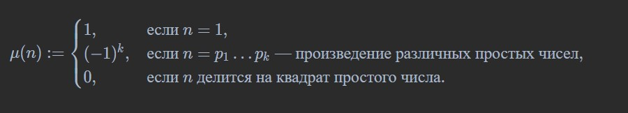
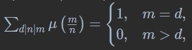

# Функция Мёбиуса. Сумма функции Мёбиуса по промежуточным делителям.

### **Определение**

Функция Мёбиуса $\mu(n)$ определяется как

### **Лемма 8**

Пусть $m, d \in \mathbb{N}$, $m : d$. Тогда

где суммирование ведется по всем $n$, кратным $d$ и делящим $m$.

#### **Доказательство**

+ Пусть $k := \frac{m}{d} = p_1^{t_1} \dots p_r^{t_r}$ — каноническое разложение. Тогда
  $\sum_{d \mid n \mid m} \mu\left(\frac{m}{n}\right) = \sum_{s \mid \frac{m}{d}} \mu(s) = \sum_{s \mid p_1 \dots p_r} \mu(s) = \prod_{\ell=0}^{r} \left(1 - (-1)^\ell \right)$
  (так как ненулевое значение $\mu$ достигается только на произведениях различных простых).
+ Наша сумма равна 0 во всех случаях, кроме $r = 0$ (а это в точности $k = 1 \iff m = d$). В последнем случае сумма равна 1.
