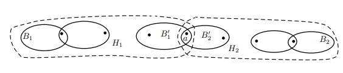
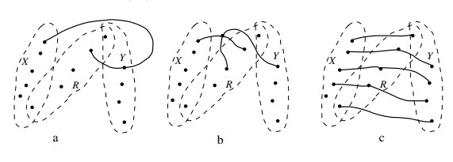
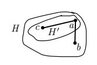

# Билет 1

## Точки сочленения и блоки в связном графе. Лемма о пересечении блоков. Каждое ребро содержится в единственном блоке.

### **Определение**

1. Вершина a ∈ V(G) называется точкой сочленения, если граф G − a несвязен.
2. Блоком называется любой максимальный по включению подграф графа G, не имеющий точек сочленения.
3. Блоки и точки сочленения несвязного графа — это блоки и точки сочленения его компонент.

+ В силу максимальности, блок графа G является индуцированным подграфом графа G на своем множестве вершин.
+ Любой подграф без точек сочленения H графа G входит хотя бы в один блок (так как H можно дополнить до максимального
  подграфа без точек сочленения).

### **Лемма 1**

Пусть $B_1$ и $B_2$ — два разных блока графа G, причём V($B_1$) $\cap$ V($B_2$) &ne; ∅. Тогда V($B_1$) $\cap$ V($B_2$) состоит из
точки сочленения a графа G, причем a — единственная точка сочленения, отделяющая $B_1$ от $B_2$.

#### **Доказательство**

+ Пусть |V($B_1$) $\cap$ V($B_2$)| ≥ 2. Тогда для любой вершины x ∈ V($B_1$ $\cup$ $B_2$) граф $B_1$ $\cup$ $B_2$ − x связен.
  Следовательно, $B_1$ $\cup$ $B_2$ содержится в блоке B графа G, а $B_1$ является собственным подграфом B, что противоречит
  максимальности $B_1$.
+ Далее пусть V($B_1$) $\cap$ V($B_2$) = {a}. Так как a — общая вершина блоков $B_1$ и $B_2$, отделить $B_1$ от $B_2$ в графе
  G может только a.
+ Если a не отделяет $B_1$ от $B_2$ в графе G, то в G − a есть V($B_1$)V($B_2$)-путь P
+ Пусть H = $B_1$ $\cup$ $B_2$ $\cup$ P. Граф H − x связен для любой вершины x ∈ V(H). Поэтому H содержится в одном блоке B графа
  G, а блок $B_1$ — собственный подграф B, противоречие.
+ Итак, a — единственная вершина, которая отделяет $B_1$ от $B_2$ в графе G. Следовательно, граф G − a несвязен, то есть
  a — точка сочленения G.
+ По Лемме 1 любой подграф без точек сочленения H графа G с v(H) > 1 входит ровно в один блок. В частности, любое ребро
  графа входит ровно в один блок.
+ Если у связного графа G хотя бы две вершины, то каждая его вершина смежна хотя бы с одной другой вершиной.
  Следовательно, любой блок графа G содержит хотя бы две вершины.

### **Определение**

+ Построим граф B(G), вершины которого соответствуют всем точкам сочленения $a_1$,..., $a_n$ графа G и всем его блокам
  $B_1$,..., $B_m$ (мы будем обозначать эти вершины так же, как и блоки). Вершины $a_i$ и $B_j$ будут смежны, если $a_i$
  ∈ V($B_j$). Других рёбер в этом графе нет.
  **Граф B(G) называется деревом блоков и точек сочленения графа G.**

---

# Билет 2

## Дерево блоков и точек сочленения. Лемма о пути и теорема.

### **Лемма 2**

Пусть $B_1$ и $B_2$ — два разных блока графа G, а P — путь между ними в графе B(G). Тогда точки сочленения графа G,
отделяющие $B_1$ от $B_2$ — это в точности те точки сочленения, что лежат на пути P. Остальные точки сочленения не
разделяют даже объединение блоков пути P

#### **Доказательство**

* Пусть x — точка сочленения графа G, не лежащая на пути P, а H — объединение всех блоков пути P.
* Для любого блока B пути P граф B − x связен. Если B — не $B_1$ и не $B_2$, то в нем можно пройти между двумя точками
  сочленения, входящими в P (эти точки отличны от x). Поэтому H − x — связный граф.
* Пусть a — точка сочленения, лежащая на P, и она входит в блоки B′1 и B′2 пути P.
* Обозначим через $H_1$ объединение всех блоков, лежащих на пути P от $B_1$ до a, а через $H_2$ — объединение всех
  блоков, лежащих на пути P от a до $B_2$.
* По доказанному выше, a не разделяет ни один из графов $H_1$ и $H_2$.
* С другой стороны, [по Лемме 1](#лемма-1) точка сочленения a отделяет блок B′1 от блока B′2, а значит, a отделяет $H_1$
  от $H_2$ и, в частности, $B_1$ от $B_2$.
  

### **Теорема 1**

1) Дерево блоков и точек сочленения связного графа G — это действительно дерево, все листья которого соответствуют
   блокам.
2) Точка сочленения a разделяет два блока $B_1$ и $B_2$ в графе G, если и только если a разделяет $B_1$ и $B_2$ в B(G).

#### **Доказательство**

1. *B(G) — связный граф.*

+ Для любых двух вершин B(G) (не важно, блоков или точек сочленения) рассмотрим путь Q в G между ними.
+ Путь Q перестраивается в путь в B(G) так:
  — участок пути Q, проходящий по одному блоку графа G, заменяем на соответствующую блоку вершину в B(G); — переход Q
  между различными блоками [по Лемме 1](#лемма-1)
  осуществляется через их общую точку сочленения — вершину B(G).
+ Предположим, что в B(G) есть простой цикл Z и рассмотрим подграф H — объединение всех блоков этого цикла.
+ Между любыми двумя входящими в Z блоками есть два независимых пути в B(G).
+ [По Лемме 2](#лемма-2) граф H не имеет точек сочленения (они должны бы были лежать на двух путях без общих внутренних
  точек).
+ Следовательно, существует блок B, содержащий H, а все (хотя бы два) блока цикла Z — собственные подграфы B, что
  невозможно.
+ *Таким образом, B(G) — дерево.*
+ Если лист B(G) соответствует точке сочленения a, то
  [по Лемме 2](#лемма-2) граф G − a связен, противоречие.

2. В дереве B(G) есть единственный путь между $B_1$ и $B_2$.
   [По Лемме 2](#лемма-2) в точности точки сочленения с этого пути отделяют $B_1$ от $B_2$ в графе G.

---

# Билет 3

## Крайние блоки.

### **Определение**

1. Назовем блок B крайним, если он соответствует висячей вершине дерева блоков и точек сочленения.
2. Внутренность _Int(B)_ блока B — это множество всех его вершин, не являющихся точками сочленения в графе G.

+ Нетрудно понять, что блок недвусвязного графа G является крайним тогда и только тогда, когда он содержит ровно одну
  точку сочленения.
+ Внутренность некрайнего блока может быть пустой. Внутренность крайнего блока всегда непуста.
+ Если у связного графа G есть точки сочленения, то он имеет хотя бы два крайних блока.
+ Если B — блок графа G, а x ∈ _Int(B)_, то граф G − x связен.

### **Лемма 3**

Пусть B — крайний блок связного графа G, а G′ = G − _Int(B)_. Тогда граф G′ связен, а блоки G′ — это все блоки G, кроме
B.

#### **Доказательство**

+ Пусть a ∈ V(B) — точка сочленения, отрезающая крайний блок B от остального графа. Тогда _Int(B)_ — это одна из
  компонент связности графа G − a, откуда очевидно следует связность графа G′.
+ Все отличные от B блоки графа G являются подграфами G′, не имеют точек сочленения и являются максимальными подграфами
  G′ с таким свойством (они были максимальными даже в G). Следовательно, все они — блоки графа G′.
+ Пусть B′ — блок графа G′. Очевидно, v(G′) ≥ 2, поэтому B′содержит хотя бы одно ребро e, которое в графе G лежит в
  некотором блоке B∗ &ne; B. Теперь очевидно, что B∗ = B ′.

---

# Билет 4

## Алгоритм построения блоков с помощью последовательных разрезов графа по точкам сочленения.

### **Определение**

+ Вершина a ∈ V(G) называется точкой сочленения, если граф G − a несвязен.

**]** Пусть $U_1$,..., $U_k$ — все компоненты связности графа G − a, a $G_i$ = G($U_i$ $\cup$ {a}). Разрежем граф G на графы
$G_1$,..., $G_k$ .

### **Лемма 4.1**

Пусть b ∈ $U_i$, Тогда b разделяет вершины x, y ∈ $U_i$ в $G_i$, если и только если b разделяет их в G.

#### **Доказательство**

+ **Необходимость**
  Если в G − b нет xy-пути, то его, очевидно, нет и в $G_i$ − b.
+ **Достаточность**
  Наоборот, пусть x и y лежат в разных компонентах связности графа $G_i$ − b. Не умаляя общности можно считать, что
  компонента связности W ∋ x не содержит a. Тогда W — компонента связности графа G − b, то есть, и в этом графе нет
  xy-пути.

### **Лемма 4.2**

Все точки сочленения графов $G_1$,..., $G_k$ — это в точности все точки сочленения графа G, кроме a.

#### **Доказательство**

+ Так как $G_i$ − a — компонента графа G − a, вершина a не является точкой сочленения ни в одном из графов $G_1$,...,
  $G_k$ .
+ Любая другая точка сочленения графа G лежит ровно в одном из графов $G_1$,. . . , $G_k$ и является в нем точкой
  сочленения по пункту 1.
+ Также [из пункта 1](#лемма-41) следует, что других точек сочленения в графах $G_1$,..., $G_k$ нет.

### **Алгоритм разбиения связного графа на блоки**

+ Выберем точку сочленения a и разрежем по ней G — заменим граф G на полученные при этом графы $G_1$,..., $G_k$
+ Каждым следующим шагом мы будем брать один из имеющихся графов, выбирать в нем точку сочленения и разрезать его по
  ней.
+ И так далее, пока хотя бы один из полученных графов имеет точку сочленения.

### **Теорема 2**

В результате описанного выше алгоритма разрезания графа по точкам сочленения вне зависимости от порядка действий
получатся блоки графа G.

#### **Доказательство**

+ [По Лемме 4](#лемма-41) мы вне зависимости от порядка действий проведем разрезы по всем точкам сочленения графа G и
  только по ним.
+ Пусть B — блок графа G. Тогда в графе G множество V(B)
  не было разделено ни одной из точек сочленения. Значит, [по пункту 1 Леммы 4](#Лемма-41) множество V(B) не было
  разрезано при нашем алгоритме.
+ Так как в результате алгоритма получились индуцированные подграфы графа G, один из них — скажем, H — является
  надграфом B.
+ Если H &ne; B, то рассмотрим вершину c ∈ V(H) \ V(B). В графе G существует точка сочленения a, отделяющая c от V(B).
  Тогда в силу [леммы 4](#лемма-41) при разрезе по a вершина c была отделена от блока B, противоречие.

---

# Билет 5

## Рекурсивный алгоритм построения дерева блоков и точек сочленения.

+ Выберем точку сочленения a и разрежем по ней G — заменим граф G на полученные при этом графы $G_1$,..., $G_k$ .
+ В каждом из графов $G_1$,..., $G_k$ построим деревья блоков и точек сочленения. Пусть, скажем, B($G_i$) = $T_i$
+ В графе $G_i$ [по Лемме 4](#лемма-41) вершина a не является точкой сочленения.
+ Значит, [по Лемме 1](#лемма-1) в $G_i$ есть единственный блок $B_i$, содержащий a.
+ Построим дерево B(G), присоединив к точке a деревья $T_1$,..., $T_k$ (дерево $T_i$ присоединяем ребром a$B_i$).

### **Теорема 3**

В результате описанного выше алгоритма будет построено дерево блоков и точек сочленения графа G.

#### **Доказательство**

+ В качестве **базы построения** отметим, что граф без точек сочленения является своим единственным блоком и его дерево
  блоков и точек сочленения тривиально.
+ **Шаг построения.**
  + Точка сочленения a должна быть соединена в точности с теми блоками графа G, которые ее содержат.
  + Из алгоритма разбиения графа на блоки следует, что это в точности блоки $B_1$,..., $B_k$ .
  + Любая другая точка сочленения b попала в одну из частей при разрезе графа G по a — скажем, в $G_1$.
  + Тогда все блоки графа G, содержащие b, лежат в $G_1$ и являются блоками графа $G_1$ (это следует из алгоритма
    разбиения на блоки уже графа $G_1$).
  + Следовательно, b соединена в $T_1$ (а значит, и в построенном нами объединенном дереве блоков) в точности с теми
    блоками, с которыми b должна быть соединена в B(G).
+ Из алгоритма построения дерева блоков и точек сочленения можно вывести его свойства (в частности, то, что это дерево и
  все его листья соответствуют блокам).
+ Более того, из алгоритма понятно, что каждая точка сочленения a разделяет блоки в B(G), если и только если она их
  разделяет в G, а $d_B(G)$(a) равняется числу компонент связности графа G − a

---

# Билет 6

## Разбиение двусвязного графа на два связных графа заданных размеров.

### **Определение**

+ Граф G является **двусвязным**, если v(G) ≥ 3 и граф не имеет точек сочленения.
+ Блок связного графа, имеющий более двух вершин — двусвязный граф.

### **Теорема 4**

Пусть G — [двусвязный граф](#двусвязный), $n_1$, $n_2$ ∈ $\mathbb{N}$, v(G) = $n_1$ + $n_2$. Тогда G = $G_1$ $\cup$ $G_2$,
где v($G_1$) = $n_1$, v($G_2$) = $n_2$ и оба графа $G_1$ и $G_2$ связные.

#### **Доказательство**

+ Индукция по $n_1$.
  + **База $n_1$ = 1** очевидна: пусть $G_1$ состоит из одной вершины v1, тогда граф $G_2$ := G − v1 связен, так как G
    не имеет точек сочленения.
  + **Переход $n_1$ → $n_1$ + 1**. В этом случае $n_2$ := v($G_2$) ≥ 2.
    + ] Пусть B — крайний блок $G_2$, а a — единственная входящая в B точка сочленения. (если $G_2$ не имеет точек
      сочленения, то B = $G_2$, a — любая вершина B).
    + В B − a есть вершина x, смежная с V($G_1$) (иначе a отделяет $G_1$ от B − a в графе G, то есть, является
      точкой сочленения, которых нет).
    + Тогда x — не точка сочленения графа $G_2$. Значит, G′2
      := $G_2$ − x связен и v(G′2) = $n_2$ − 1.
    + Так как x смежна с $G_1$, граф $G'_1$, полученный из $G_1$ добавлением x и всех ребер графа G от x к $G_1$,
      связен.
    + **v(G′1) = $n_1$ + 1.**

---

# Билет 7

## Теорема Менгера в форме Гёринга (для двух множеств).

### **Теорема 5**

_(F. Göring, 2000.)_ Пусть X, Y ⊂ V(G), $K_G$ (X, Y ) ≥ k, |X| ≥ k, |Y | ≥ k. Тогда в графе G существуют k
непересекающихся XY -пyтей.

#### **Доказательство**

+ Индукция по количеству вершин в графе. Доказывая утверждение для графа G и пары множеств X, Y , мы будем считать
  утверждение уже доказанным для всех меньших графов.
  **База:** V(G) = X $\cup$ Y
+ Пусть W = X $\cap$ Y, X′ = X \ W и Y′ = Y \ W, а H — двудольный подграф G(X′ $\cup$ Y′), содержащий все ребра G между X′ и Y′
+ Нам достаточно доказать, что H содержит совершенное паросочетание (тогда ребра этого паросочетания и вершины из W как
  раз будут k искомыми путями).
+ Пусть это не так, рассмотрим максимальное паросочетание M в H, пусть |M| = m < |X′|.
+ Тогда по теореме Кёнига (2.5) в H существует вершинное покрытие B из m вершин.
+ Это означает, что множество R = B $\cup$ W отделяет X от Y, причем |R| < |X| = k, противоречие.
  **Переход:** V(G) \ (X $\cup$ Y ) &ne; ∅.
  1. **(Случай первый) cуществует множество R из k вершин, разделяющее X и Y**
     + Никакой XR-путь не содержит вершины из Y \ R (иначе существовал бы XY -путь, не содержащий ни одной вершины
       множества R, см. рис a).
     + Следовательно, любое множество S, отделяющее X от R в графе $G_x$ = G − (Y \ R), отделяет X от R и в графе G.
       Но тогда S отделяет X от Y в графе G, cледовательно, |S| ≥ k.
       
     + По индукционному предположению существует k непересекающихся XR-путей в графе Gx, а следовательно, и в графе
       G.
     + Аналогично, существует k непересекающихся RY -путей в графе G.
     + Никакой XR-путь не пересекает никакой RY -путь
       (иначе существовал бы XY -путь, не содержащий ни одной вершины множества R, см. рис. b).
     + Так как |R| = k, то мы можем состыковать XR-пути и RY -пути по вершинам множества R, получив k
       непересекающихся XY -путей (см. рис. c)
  2. **(Случай второй) Нет множества из k вершин, разделяющего X и Y**
     + Пусть a ∈ V(G) \ (X $\cup$ Y ) и G′ = G − a.
     + Тогда любое множество R′ , отделяющее X от Y в G′ имеет хотя бы k вершин (так как R′ $\cup$ {a} отделяет X от Y в
       G).
     + По индукционному предположению в графе G′ (подграфе G) существуют k искомых XY -путей.

---

# Билет 8

## Следствие — две формы теоремы Менгера (для двух вершин и для вершины и множества).

### **Следствие 1**

_(K. Menger, 1927.)_ Пусть вершины x, y ∈ V(G) несмежны, κG (x, y) ≥ k. Тогда существует k независимых путей из x в y.

#### **Доказательство**

+ Пусть X = $n_G$(x) и Y = $n_G$(y).
+ Так как x и y несмежны, множество X отделяет вершину x от вершины y. Значит, |X| ≥ k и (аналогично)
  |Y | ≥ k.
+ Любой xy-путь идёт из x в X, далее в Y и затем в y. Поэтому, множество вершин R, отделяющее X от Y , отделяет вершину
  x от вершины y. Следовательно, |R| ≥ k.
+ По теореме 5 существует k непересекающихся XY -путей. Значит, есть и k независимых xy-путей.

### **Следствие 2**

Пусть x ∈ V(G), Y ⊂ V(G), x $\approx $ Y, k = min(|Y |, $n_G$(x, Y )). Тогда существуют k путей от x до различных вершин
множества Y , не имеющих общих внутренних вершин.

#### **Доказательство**

+ Пусть X = $n_G$(x). Очевидно, |$n_G$(x)| ≥ k.
+ Так как x ∉ Y , любое множество вершин R, отделяющее X от Y , отделяет вершину x от множества Y . Следовательно, |R| ≥
  k.
+ Так как и |Y | ≥ k, [по Теореме 5](#теорема-5) существует k непересекающихся XY -путей в графе G, а следовательно, и k
  непересекающихся путей от x до различных вершин множества Y

---

# Билет 9

## Теорема Уитни.

### **Теорема 6**

_(H. Whitney, 1932.)_ Пусть G — k-связный граф. Тогда для любых двух вершин x, y ∈ V(G) существует k независимых
xy-путей.

#### **Доказательство**

+ Индукция по k, база для k = 1 очевидна. Докажем утверждение для k-связного графа, считая, что оно доказано для графов
  меньшей связности.
+ Если вершины x и y несмежны, то утверждение следует из [Cледствия 1](#следствие-1). Далее вершины x и y смежны.
+ Если G − xy — (k − 1)-связный граф, то по индукционному предположению существует k − 1 независимых xy-путей в графе G
  − xy, а еще один путь — это ребро xy.
+ Пусть в G − xy существует разделяющее множество T, |T| ≤ k − 2. Так как T не является разделяющим множеством в G,
  легко понять, что в графе G − (T $\cup$ {xy}) ровно две компоненты связности: Ux ∋ x и Uy ∋ y (возвращение ребра xy дает
  связный граф G − T).
+ Пусть $T_x$ = T $\cup$ {x}. Если $U_x$ &ne; {x}, то Tx отделяет $U_x$ \ {x} от $U_y$ в G, что невозможно (так как |$T_x$ | ≤ k
  − 1).
+ Тогда $U_x$ = {x}. Аналогично,$U_y$ = {y}. Таким образом, в графе G не более k вершин: это вершины множества T, x и y.
  Противоречие с определением k-связного графа.

---

# Билет 10

## Теорема Дирака о цикле, содержащем заданные k вершин

### **Теорема 7**

_(G. A. Dirac.)_ Пусть k ≥ 2. В k-связном графе для любых k вершин существует простой цикл, содержащий все эти вершины.

#### **Доказательство** (Докажем теорему индукцией по k.)

**База для k = 2** следует из теоремы Уитни [Теоремы 6](#теорема-6).
**Переход k − 1 → k:**

+ Пусть k > 2. Рассмотрим k-связный граф G и его вершины $v_1$,... , $v_k-1$, $v_k$ Так как G является (k − 1)-связным
  графом, по индукционному предположению существует простой цикл Z, содержащий вершины $v_1$,... , $v_k-1$.

1. **(Случай первый) v(Z) < k.**

   + Тогда V(Z) = {$v_1$,... , $v_k-1$} и [по Следствию 2](#Следствие-2)
     существуют непересекающиеся пути от $v_k$ до всех вершин цикла Z. В этом случае легко вставить vk в цикл Z между его
     соседними вершинами и получить искомый цикл.
2. **(Cлучай второй)  v(Z) ≥ k**

   + [По Следствию 2](#Следствие-2) существует k непересекающихся путей от vk до цикла Z.
   + Пусть $x_1$,..., $x_k$ ∈ V(Z) — концы этих путей в порядке их следования по циклу (нумерация — циклическая). Они
     делят цикл на k дуг и внутренность одной из этих дуг.
   + Одна их этих дуг (скажем, дуга L с концами $x_i$ и $x_i+1$)
     не содержит ни одной из вершин $v_1$,... , $v_k-1$. Тогда заменим дугу L на путь от xi до vk и путь от vk до xi+1,
     в результате получится искомый цикл.

---

# Билет 11

## Лемма о k-вершинном разделяющем множестве в k-связном графе

### **Лемма 5**

Пусть G — k-связный граф, S ⊂ V(G) — разделяющее множество, |S| = k, а U — компонента связности графа G − S. Тогда для
любой вершины a ∈ S существует вершина x ∈ U, смежная с a.

#### **Доказательство** (от противного: пусть такой вершины нет)

+ Пусть W — отличная от U компонента связности графа G − S
+ Тогда никакой путь в графе G из U в W не проходит через a.
+ Пусть S′ = S \ {a}. Тогда в графе G − S′ нет пути из U в W, то есть, этот граф несвязен.
+ Так как |S′| = k − 1, получаем противоречие с k-связностью G.

---

# Билет 12

## Стягивание ребра в двусвязном графе без потери двусвязности.

### **Определение**

**Двусвязный граф** — это связный граф, в котором удаление любой вершины (с её инцидентными рёбрами) не нарушает
связность.
**Стягивание ребра** — операция над графом, при которой два конца ребра 𝑢𝑣 сливаются в одну вершину, а все рёбра,
инцидентные 𝑢 и 𝑣, переназначаются на новую вершину (повторы рёбер исключаются).

### **Теорема 8**

Пусть G — двусвязный граф, v(G) ≥ 4, a ∈ V(G). Тогда существует такое ребро ab ∈ E(G), что граф G · ab двусвязен.

#### **Доказательство**  (от противного)

**Утверждение** Для любого ребра ax ∈ E(G) множество {a, x} — разделяющее в графе G.

+ Тогда граф G · ax имеет точку сочленения — скажем, w.
+ Если w = a · x, то граф G − {a, x} = G · ax − a · x несвязен, что нам и нужно.
+ Пусть w a · x. Тогда пусть A — компонента связности G − w, содержащая вершину a · x, а B — другая компонента G − w.
+ Пусть A′ = (A \ a · x) $\cup$ {a, x}). Тогда в графе G − w нет пути из A′ в B, что противоречит двусвязности G.
+ Рассмотрим все графы вида G − {a, x}, где ax ∈ E(G) и все их компоненты связности.
+ Выберем из них минимальную компоненту H. Пусть ab ∈ E(G), а H — компонента графа G − {a, b}.
+ [По Лемме 5](#лемма-5), существует вершина c ∈ H, смежная с a. Тогда
  [по Утверждению](#утверждение-1) граф G − {a, c} несвязен.
+ Пусть $W_1$,..., $W_k$— все отличные от H компоненты G − {a, b}.
+ Так как [по Лемме 5](#Лемма-5) в каждой компоненте Wi есть вершина, смежная с b, множество $\$B_i$gcup_{i=1}^{k} W_i$
  $\cup$ {b} связано в графе G − {a, c}, то есть, лежит в одной компоненте связности W этого графа.
+ Следовательно, любая другая компонента H′ графа G − {a, c} — подмножество H \ {c}, противоречие с минимальностью H.
  

---

# Билет 13

## Зависимые и независимые разделяющие множества.

### **Определение**

+ Пусть G — k-связный граф. Через $R_k$(G) обозначим множество всех k-вершинных разделяющих множеств G. Назовем
  различные множества S,T ∈ $R_k$ (G) независимыми, если S не разделяет T и T не разделяет S. В противном случае мы
  будем называть эти множества зависимыми.
+ Через _**Comp(H)**_ обозначим множество всех компонент связности графа H

### **Лемма 6**

Пусть G — k-связный граф, S,T ∈ $R_k$(G) и компонента A ∈ _Comp(G − S)_ таковы, что T $\cap$ A = ∅. Тогда T не разделяет A $\cup$
S.

#### **Доказательство**

+ Граф G(A) связен.
+ [По Лемме 5](#лемма-5) любая вершина x ∈ S \ T смежна хотя бы с одной из вершин A.
+ Следовательно, граф G(A $\cup$ (S \ T)) связен, откуда следует,

### **Лемма 7**

Пусть G — k-связный граф, S,T ∈ $R_k$(G) таковы, что множество S не разделяет множество T. Тогда множество T не
разделяет множество S (то есть, эти множества независимы).

#### **Доказательство**

+ Так как S не разделяет T, множество T может пересекать внутренность не более, чем одной из компонент _Comp(G − S)_.
+ Тогда существует такая компонента A ∈ _Comp(G − S)_, что A $\cap$ T = ∅.
+ [По Лемме 6](#лемма-6) T не разделяет S.

# Билет 14

## Разбиение k-связного графа парой независимых разделяющих множеств: лемма о компонентах.

### **Лемма 8**

Пусть G — k-связный граф, множества S,T ∈ Rk (G)
независимы, а компонента A ∈ _Comp(G − S)_ такова, что T ⊂ A $\cup$ S (такая, очевидно, есть).

### **Лемма 8.1**

Тогда существует такая компонента B ∈ _Comp(G − T)_, что B содержит S \ T и все отличные от A компоненты из _Comp(G −
S)_.

#### **Доказательство**

+ Множество T не пересекает отличных от A компонент из _Comp(G − S)_.
+ [По Лемме 7](#лемма-7) тогда множество T не разделяет никакой отличной от A компоненты из _Comp(G − S)_.
+ Поскольку S \ T &ne; ∅, существует такая компонента B ∈ _Comp(G − T)_, что B содержит S \ T и все отличные от A
  компоненты из _Comp(G − S)_.

### **Лемма 8.2**

Все отличные от B компоненты из _Comp(G − T)_ — подмножества A.

#### **Доказательство**

+ Прямое следствие [пункта 1](#лемма-81). :)

---

---

# Билет 15

## Стягивание ребра в трёхсвязном графе без потери трёхсвязности.

### **Теорема 9**

_(W. T. Tutte.)_ Пусть G — трёхсвязный граф с v(G) ≥ 5. Тогда существует такое ребро e ∈ E(G), что граф G · e
трёхсвязен.

**Утверждение** Для любого ребра ab ∈ E(G) существует такое множество $T_{ab}$ ∈ $R_3$(G), что $T_{ab}$ ∋ a, b.

#### **Доказательство** (от противного)

+ Пусть ab ∈ E(G). Тогда граф G · ab нетрёхсвязен, а значит, имеет двухвершинное разделяющее множество S.
+ Пусть ab ∈ E(G). Тогда граф G · ab нетрёхсвязен, а значит, имеет двухвершинное разделяющее множество S.
+ Пусть w = a · b. Предположим, что w $\notin$ S.
+ Так как ab ∈ E(G), вершины a, b лежат в одной компоненте Comp(G − S).
+ Пусть U ∈ Comp(G · ab − S) — другая компонента. Тогда в G · ab нет пути из U в w.
+ Значит, в G − S нет пути из U в {a, b} — противоречие с трёхсвязностью G.
+ Остается случай, когда w ∈ S. Пусть S = {w, x}.
+ Тогда $T_{a,b}$ = {a, b, x} нам подходит: граф G − {a, b, x} = G · ab − w несвязен.
+ Рассмотрим минимальную компоненту связности H, отделяемую в графе G множеством, содержащим две вершины одного ребра.
+ Пусть ab ∈ E(G), $T_{ab}$ = {a, b, c}, H ∈ Comp(G − $T_{ab}$).
+ Существует вершина d ∈ H, смежная с c. Рассмотрим множество $T_{cd}$ ∈ $R_3$(G).
+ Так как $T_{ab}$ \ $T_{cd}$ ⊂ {a, b}, а эти две вершины смежны, $T_{cd}$ не разделяет $T_{ab}$.
+ Тогда $T_{ab}$ и $T_{cd}$ независимы [по Лемме 7](#лемма-7).
+ [По Лемме 8](#лемма-8) существует такая компонента H' ∈ _Comp(G − $T_{cd}$ )_, что H′ ⊊ H.
+ Противоречие с минимальностью H.

---
