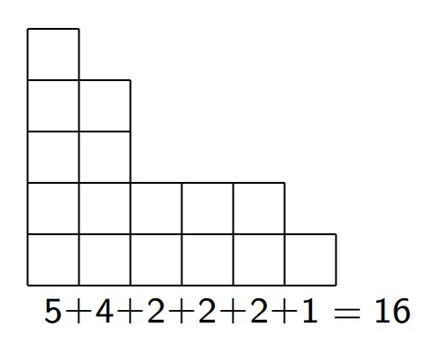
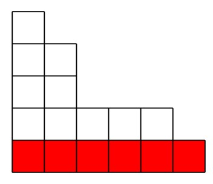

# Билет 32

## Упорядоченные и неупорядоченные разбиения. Формула для числа упорядоченных разбиений

### **Определение**

+ Разбиением натурального числа n на m слагаемых называется представление n в виде n = $x_1$ + $x_2$ +...+ $x_m$, где
  $x_1$, $x_2$,..., $x_m$ ∈ $\mathbb{N}$.
+ Разбиения называются **упорядоченными**, если порядок слагаемых имеет значение, и **неупорядоченными** в противном
  случае.
+ **Неупорядоченное разбиение** — это класс эквивалентности, где эквивалентными считаются последовательности,
  отличающиеся лишь порядком членов.

### **Теорема 1**

1. Количество упорядоченных разбиений числа n на m слагаемых равно $C_{n-1}^{m-1}$
2. Количество упорядоченных разбиений числа n равно $2^{n-1}$

#### **Доказательство**

1. Нужно найти количество натуральных решений уравнения $x_1$ + $x_2$ + ... + $x_m$ = n.
   + Выложим в ряд n шариков и расставим между ними m − 1 перегородку.
   + Это можно сделать $C_{n-1}^{m-1}$ способами.
   + Получаем биекцию между решениями и расстановками перегородок
2. $\sum_{m=1}^{n} C_{n-1}^{m-1}$ = $2^{n-1}$

# Билет 33

## Упорядоченные разбиения на нечетные слагаемые.

### **Определение**

_**Числа Фибоначчи**_ — это последовательность $F_n$, задаваемая следующими условиями: $F_1$ = $F_2$ = 1 и $F_{n+1}$ =
$F_n$ + $F_{n−1}$ при n > 1.

### **Теорема 2**

Количество упорядоченных разбиений числа n на нечетные слагаемые равно $F_n$.

#### **Доказательство**

+ Индукция по n.
  + База: при n = 1 и n = 2 утверждение очевидно.
  + Переход (n − 1, n → n + 1): Пусть n + 1 = $x_1$ +...+ $x_m$−1 + $x_m$ — разбиение на нечетные слагаемые.
    1. **(Случай первый) $x_m$ = 1**
       + Тогда n = $x_1$ +...+ $x_{m−1}$ . Таких разбиений $F_n$.
    2. **(Случай второй) $x_m$ ≥ 3**
       + m ≥ 3. Тогда n − 1 = $x_1$ +...+ $x_{m−1}$ + ($x_m$ − 2). Таких разбиений $F_{n−1}$.
  + Итого, получаем $F_n$ + $F_{n-1}$ = $F_{n+1}$ разбиений.

---

# Билет 34

## Неупорядоченные разбиения. Связь с диаграммами Юнга. Запись в виде решений специального уравнения.

### **Определение**

+ $p_m$(n) — количество неупорядоченных разбиений числа n на m слагаемых;
+ p(n) — количество неупорядоченных разбиений числа n.

### **Стандартная форма записи**

Слагаемые неупорядоченного разбиения обычно записывают в невозрастающем порядке:
n = $x_1$ +...+ $x_m$, где $x_1$ ≥ $x_2$ ≥...≥ $x_m$ > 0.

### **Диаграммы Юнга**

+ Каждому разбиению числа n соответствует следующая диаграмма из n клеток.
+ Столбцы диаграммы соответствуют слагаемым. Количество столбцов равно m.
  

### **Теорема 3**

1. Количество решений уравнения $t_1$ + 2* $t_2$ + 3* $t_3$ + ... + n* $t_n$ = n в целых неотрицательных числах равно p(
   n).
2. Количество решений [уравнения (1)](#уравнение-1), удовлетворяющих условию $t_1$ +...+ $t_n$ = m, равно $p_m$(n).

#### **Доказательство**

+ Пусть n = $x_1$ +...+ $x_m$ — разбиение числа n.
+ Обозначим через $t_k$ количество слагаемых в этом разбиении, равных k.
+ Получим решение [уравнения (1)](#уравнение-1).
+ Аналогично, каждому решению ( $t_1$ , $t_2$ ,..., $t_n$ ) [уравнения (1)](#уравнение-1)
  соответствует разбиение n, в котором ровно $t_k$ слагаемых, равных k.
+ При этом, количество слагаемых в разбиении будет равно $t_1$ +... + $t_n$.

---

# Билет 35

## Рекуррентная формула для числа разбиений на фиксированное число слагаемых.

### **Теорема 4**

$p_m$(n) = $p_m$(n-m) + $p_{m-1}$(n-m) +...+ $p_1$(n-m).

#### **Доказательство**

+ Рассмотрим диаграмму Юнга с n клетками и m столбцами.
+ Удалим нижнюю строку.
+ Получим диаграмму с n − m клетками и k ≤ m столбцами.

### **Следствие 1**

Количество неупорядоченных разбиений числа n − m на не более чем m слагаемых равно $p_m$(n).

### **Следствие 2**

$p_m$(n) = $p_m$(n-m) + $p_{m-1}$(n-1).

#### **Доказательство**

$p_m$(n) = $p_m$(n-m) + ( $p_{m-1}$(n-m) +...+ $p_1$(n-m)) = $p_m$(n-m) + $p_{m-1}$(n-1).

### **Замечание**

+ Отметим, что p1(n) = 1 при всех n.
+ При помощи доказанных выше рекуррентных соотношений, можно получить явные формулы для $p_m$(n) при малых m.
+ Мы сделаем это для m = 2 и m = 3.

---

# Билет 36

## Явные формулы для числа разбиений на 2 и 3 слагаемых.

### **Определение**

+ Пусть x ∈ $\mathbb{R}$.
+ Через [x] обозначается целая часть числа x, т. е, наибольшее целое число, не превосходящее x.
+ Через {x} обозначается дробная часть числа x, т. е, {x} $\stackrel{\text{def}}{=}$ x − [x].

### **Теорема 5.1 (де Морган)**

$p_2$(n) = $[\frac{n}{2}]$

#### **Доказательство**  _Индукция по n._

_!Точный квадрат может быть сравним только с 0 или 1 по модулям 3 и 4_

+ База: при n = 1 и n = 2 утверждение очевидно.
+ Переход (n − 2 → n):
  $p_2$(n) = $p_2$(n-2) + $p_1$(n-1) = $[\frac{n-2}{2}]$ + 1 = $[\frac{n-2}{2} + 1]$ = $[\frac{n}{2}]$

### **Теорема 5.2 (де Морган)**

$p_3$(n) = $[\frac{n^2+3}{12}]$

#### **Доказательство**  _Индукция по n._

_!Точный квадрат может быть сравним только с 0 или 1 по модулям 3 и 4_

+ База: при n = 1, n = 2 и n = 3 утверждение очевидно.
+ Переход (n − 3 → n):
  $p_3$(n) = $p_3$(n-3) + $p_2$(n-1) = $[\frac{(n-3)^2+3}{12}]$ + $[\frac{n-1}{2}]$  =
  = $[\frac{(n^2-6*n+12)+(6n-6)}{12}]$
  = $[\frac{n^2+6}{12}]$ = $[\frac{n^2+3}{12}]$

**Док-ть:** $[\frac{(n-3)^2+3}{12}]$ + $[\frac{n-1}{2}]$ = $[\frac{(n^2-6*n+12)+(6n-6)}{12}]$ Нужно доказать, что
$\{\frac{(n-3)^2+3}{12}\}$ + $\{\frac{n-1}{2}\}$ < 1

+ $n \nmid 2$ $\{\frac{n-1}{2}\}$ = 0 и $\{\frac{(n-3)^2+3}{12}\}$ < 1
+ $n \mid 2$ пусть n = 2k, тогда $\{\frac{n-1}{2}\}$ = $\frac{1}{2}$ и $\{\frac{(n-3)^2+3}{12}\}$ =
  = $\{\frac{4k^2 - 12k + 12}{12}\}$ = $\{\frac{k^2}{3}\}$ <= $\frac{1}{3}$

**Док-ть:** $[\frac{n^2+6}{12}]$ = $[\frac{n^2+3}{12}]$ Нужно доказать, что числа $\frac{n^2+4}{12}$,
$\frac{n^2+5}{12}$, $\frac{n^2+6}{12}$ не целые

#### НО!

+ ${n^2+4} \nmid 3$ тк n^2 $\not\equiv 2 \pmod{3}$
+ ${n^2+5} \nmid 4$ тк n^2 $\not\equiv 3 \pmod{4}$
+ ${n^2+6} \nmid 4$ тк n^2 $\not\equiv 2 \pmod{4}$

### **Лемма 1**

[x] + [y] = [x + y] ⇔ {x} + {y} < 1

#### **Доказательство**

x + y = ([x] + {x}) + ([y] + {y}) = ([x] + [y]) + ( {x} + {y})

### **Теорема 6**

$p_m$(n) = $\frac{n^{m-1}}{(m-1)!m!}$ + $c_{m-2}$(m,n) $n^{m-2}$ + ...+ $c_1$(m,n)n + $c_0$(m,n)n где коэффициенты $c_k$(
m, n) зависят только от класса вычетов n по модулю m!.

+ В частности, если n ≡ n0 (mod m!) при фиксированном n0, то $p_m$(n)
  является многочленом степени m − 1 от переменной n. (без доказктельства!!!)

### **Замечание**

+ Количество упорядоченных разбиений числа n на m слагаемых равно $C_{n-1}^{m-1}$
+ При фиксированном m это также многочлен от n со старшим членом $\frac{n^{m−1}}{(m−1)!}$
+ Следовательно, $\lim_{n \to \infty} \frac{p_m(n)}{C_{n-1}^{m-1}}$ = $\frac{1}{m!}$
+ Это означает, что “почти все” разбиения n на m слагаемых состоят из различных слагаемых.

---

# Билет 37

## Формула для количества разбиений числа n на m различных слагаемых

### **Теорема 7**

Количество разбиений числа n на m различных слагаемых равно $p_m$(n - $\frac{m(m-1)}{2}$)

#### **Доказательство**

+ Пусть n = $x_1$ + $x_2$ + . . . + $x_m$, где $x_1$ > $x_2$ > . . . > $x_m$ > 0.
+ Рассмотрим числа $y_i$ = $x_i$ − m + i.
  + $y_i$ − $y_{i+1}$ = ($x_i$ − m + i) − ($x_{i+1}$ − m + i + 1) = $x_i$ − $x_{i+1}$ − 1 ≥ 0;
  + следовательно, $y_1$ ≥ $y_2$ ≥ . . . ≥ ym = $x_m$ > 0
  + $y_1$ + $y_2$ + . . . + ym =
    =  $x_1$ + $x_2$ + . . . + $x_m$ − ((m − 1) + (m − 2) + . . . + 1) = n - $\frac{m(m-1)}{2}$
  + Итак, каждому разбиению n на m различных слагаемых поставили в
    соответствие разбиение n - $\frac{m(m-1)}{2}$)на m слагаемых.
  + Очевидно, что это биекция

---

# Билет 38

## Пентагональная формула Эйлера

---
